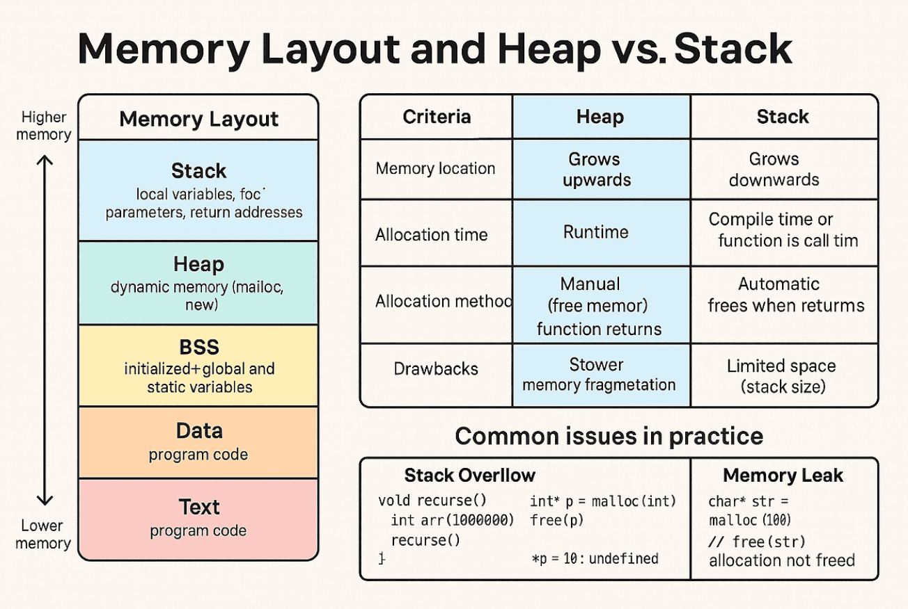
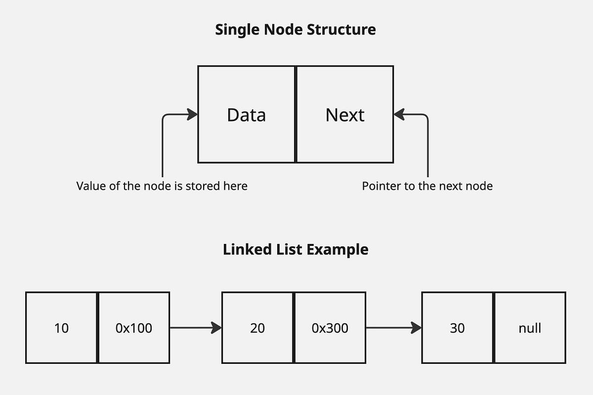

<h1 align="center">
  <br>
  ⚓ mem_gbc
  <br>
</h1>

<h4 align="center">A lightweight, Arena-like Garbage Collector and Memory Tracker in C.</h4>

<p align="center">
  <a href="https://en.wikipedia.org/wiki/C_(programming_language)">
    
  </a>
  <a href="https://valgrind.org/">
    
  </a>
  <a href="LICENSE">
    
  </a>
  <a href="#architecture">
    
  </a>
</p>

<p align="center">
  <i>🌍 Read this document in other languages:</i><br>
  <a href="assets/README-en.md">🇬🇧 English</a> | <a href="Readme.md">🇹🇭 ภาษาไทย</a>
</p>

<p align="center">
  <a href="#-1-introduction">Introduction</a> •
  <a href="#-2-memory-layout">Memory Layout</a> •
  <a href="#-3-architecture">Architecture</a> •
  <a href="#-4-allocation-flow--ram-overhead">Allocation Flow</a> •
  <a href="#-5-how-to-use">How To Use</a> •
  <a href="#-6-comparison">Comparison</a> •
  <a href="#-7-use-cases">Use Cases</a>
</p>

---

## 🚀 1. Introduction

In C programming, one of the greatest challenges is **Manual Memory Management**. Every time you allocate memory using `malloc()`, the full responsibility of freeing it falls on you. As programs grow in complexity, with intricate branching logic or unexpected runtime errors, the risk of memory leaks and double frees increases exponentially.

`mem_gbc` was created to eliminate this burden by acting as a smart wrapper around standard memory allocation:
* **Auto-Tracking:** Every allocated memory block's address is automatically recorded in a centralized tracker.
* **Single Point Cleanup:** When the program finishes execution or encounters a fatal error, a single call to `gbc_clear()` instantly sweeps all heap-allocated memory and returns it to the OS.

---

## 🧠 2. Memory Layout

To understand how `mem_gbc` works, it helps to visualize how the Operating System allocates memory to a C program:



* **Stack Memory:** Managed via LIFO (Last-In, First-Out). It is extremely fast and used for local variables and function call frames. Variables are automatically destroyed when they go out of scope, making it impossible to pass large datasets across lifecycles safely.
* **Heap Memory:** A vast memory pool manually controlled by the programmer via `malloc()` and `free()`. Data persists until explicitly freed. If a pointer address is lost before it is freed, a Memory Leak occurs immediately.
* **Data Segment & BSS (Static / Global Memory):** Stores global variables and `static` variables. These variables live for the entire Program Lifetime (created when the process starts and destroyed only when the process terminates).

---

## 🏗️ 3. Architecture

The classic dilemma when building a central memory tracker is: *"Where do we store the Head pointer of the tracker without polluting the code with dirty global variables?"*

The safest and cleanest solution is utilizing an **Encapsulated Singleton** via a function:

```c
/* Pointer Storage Implementation */
t_lst **global_pointer_storage(void)
{
    static t_lst *storage;

    return (&storage);
}
```

### Why use `static` inside a function?
The `storage` variable resides in the **BSS Segment**, meaning its lifetime spans the entire program. Declaring it inside the function scope ensures that no external files can directly access or reassign this pointer, granting 100% protection against Data Tampering.

### Why return a Double Pointer (`t_lst **`)?
The `storage` variable acts as the Head Pointer for our Linked List (pointing to the very first node). When we need to prepend a new node or execute `*head = NULL` during a reset, external functions must be able to modify the address of the pointer itself (`&storage`). Returning a double pointer allows list manipulation functions (like `lst_addback()` and `lst_clear()`) to directly overwrite the actual pointer securely housed in the BSS.

---

## ⚙️ 4. Allocation Flow & RAM Overhead



### Why wrap it with `gbc_malloc()`?
When you call `gbc_malloc(size)`, two things happen behind the scenes:
1. It requests actual space on the Heap for the User Data Block.
2. It creates a `t_lst` Node to store the address of that block, and appends it to the Tracker.

```c
/* Data Flow and Memory Allocation Architecture */
void *gbc_malloc(size_t size)
{
    void  *user_block = malloc(size);         // [Heap] Allocate actual data space
    t_lst *node       = lst_new(user_block);  // [Heap] Create node to store the address

    lst_addback(global_pointer_storage(), node); // [BSS] Link to the Anchor Pointer
    return (user_block);
}
```

### The Big Question: Will the Global/BSS memory get full?
**Answer: Absolutely not.**

The BSS segment does not hold the actual tracked data. The only thing residing in the BSS is a **single 8-byte pointer** (`static t_lst *storage;` on a 64-bit architecture). It acts purely as an "Anchor", pointing to the first node in the Heap.

| Memory Segment | What is Stored | Growth Behavior |
| :--- | :--- | :--- |
| **BSS Segment** | Anchor Pointer (`static t_lst *storage`) | Strictly fixed at 8 bytes. |
| **Heap Segment** | User Data Blocks + Tracker Linked List Nodes | Expands dynamically based on actual memory requested. |

---

## 💻 5. How To Use

```c
#include <stdio.h>
#include "mem_gbc.h"

int main(void)
{
    // 1. Allocate memory using gbc_malloc just like standard malloc
    char *str = gbc_malloc(32 * sizeof(char));
    int  *arr = gbc_malloc(10 * sizeof(int));

    // 2. Clean error handling: If anything fails, clear everything at once
    if (!str || !arr)
    {
        gbc_clear();
        return (1);
    }

    // 3. Use the allocated data normally
    snprintf(str, 32, "Hello, mem_gbc!");
    printf("%s\n", str);

    // 4. Free all memory allocated via gbc_malloc in a single command
    gbc_clear();
    return (0);
}
```

---

## ⚖️ 6. Comparison

| Feature | Standard `malloc()` / `free()` | `mem_gbc` |
| :--- | :--- | :--- |
| **Error Cleanup** | Requires nested/backward `free()` at every failure branch. | One `gbc_clear()` covers all possible exit paths. |
| **Memory Leak Risk** | Very High (Missing a single `free()` causes a leak). | Near Zero (0 leaks as long as `gbc_clear()` is called). |
| **Double Free Risk** | Common when dealing with complex data structures. | Impossible, as lifecycle management is centralized. |
| **Code Readability** | Cluttered with boilerplate cleanup code. | Clean, allowing you to focus purely on Core/Business Logic. |

---

## 🎯 7. Use Cases

* 🖥️ **CLI Tools & Parsers:** Programs that need to read input, build large Syntax Trees, output a result, and terminate immediately.
* 🏫 **School & Low-Level Projects (e.g., 42 Network):** Projects that strictly require **0 leaks and 0 errors from Valgrind** without writing complex cleanup logic for every `if (err)` condition.
* 🎮 **Loop & Frame-based Processing:** Acts as an Arena Allocator or Scratchpad Memory, allowing you to flush and wipe an entire memory context cleanly at the end of a computation cycle.

---

<p align="center">
  Crafted with care for clean & leak-free C development.
</p>
